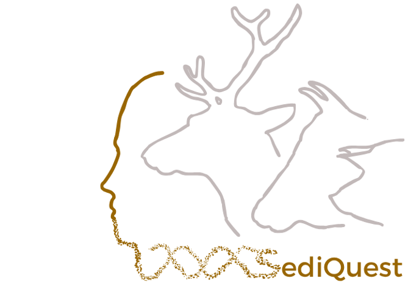

This pipeline is a friendly-user implementation of the Vernot et al. (2021) workflow. It aims to extract human reads from capture data to perform further analysis. The set of sites used to capture the DNA is called a probeset here.

The aim of this pipeline is to filter out mammalian contamination. To achieve this, a Kraken step is performed at stages X and X of the pipeline, and three sensitivity filtering parameters are available:

 - Low sensitivity: 

```bash
score_b: "ALL"

score_n: "ALL"

filter: "LOW"
```

 - Middle sensitivity

```bash
score_b: [x]

score_n: "ALL"

filter: "LOW"
```
x being a number you will chose according to the coverage plot (see the output section)


- High sensitivity

```bash
score_b: [x]

score_n: "ALL"

filter: "HIGH"
```
This filtering is a combined filter of mammalian diversity score and kraken to save as much data as you can in a case of a highly faunal contaminated sample

---
## Requirements

- samtools 1.18
- bedtools v2.25.0
- Python 3.6.15

## Required Files

- **`config.yaml`** – Configuration file with parameters, see config_example.yaml to have more information.

Please be aware the pipeline by default should first be run with this parameters:

```bash
score_b: "ALL"

score_n: "ALL"

filter: "LOW"
```


- **`probeset.csv`** – Table with information about the nuclear probes each sample was captured with. 
This table should include:
  - A modified reference genome where you replaced the target sites by a "third" base (see Vernot et al. 2021).
  - An optional BED file with mammalian diversity scores for filtering (useful if you set score_b to something else then ALL)
  - A BED file with target regions


| probeset   | path_to_ref | path_to_bed    | path_to_control     |
|--------|-----|-------------|-------------|
| 1240k  | whole_genome_modified_1240k.fa  | mammalian_diversity_score_1240k.bed      | 1240k.bed    |


- **`samples.csv`** – Table with sample information. Must include at least:
  - LibraryID
  - Probeset
  
| probeset_to_lib   | indexlibid  | 
|--------|-----|
| 1240k  | Lib.1608   |


## Time to play with your data

### Before – Verify Mapping
To ensure your genome is mapped to the modified reference genome corresponding run:

```bash
python check_reference_mapping.py  
```

### Run the pipeline

```bash
snakemake run_pipeline --snakefile  SediQuest.smk --configfile config_example.yaml --cores 25
```

### After - Check the output

Plots and Tables are available for you to look at, here is a bried description of them:

- Summary table

| IndexLibID |	N_score | MD_score | probeset | split | mapped | unique | target | kraken_target | deam | kraken_deam | 5CT | 3CT | 5CT_95CI | 3CT_95CI | cond5CT | cond3CT | cond5CT_95CI | cond3CT_95CI | average_dup | SNPs_count_target | SNPs_count_deam | Contamination | Contamination_err_estimate
|--------|-----|-------------|-------------|--------|-----|-------------|-------------|--------|-----|-------------|-------------|--------|-----|-------------|-------------|--------|-----|-------------|-------------|--------|-----|-------------|-------------|

- Overall coverage plot

This plot is an example, generated from a deer bone and a human bone for you to investigate if your sediment sample look like it has faunal contamination in it or not.


- Kraken coverage plot

This plot is an example from a sediment sample
